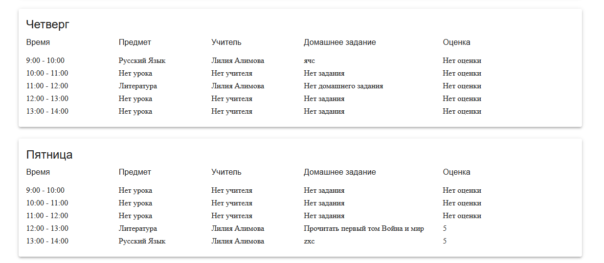
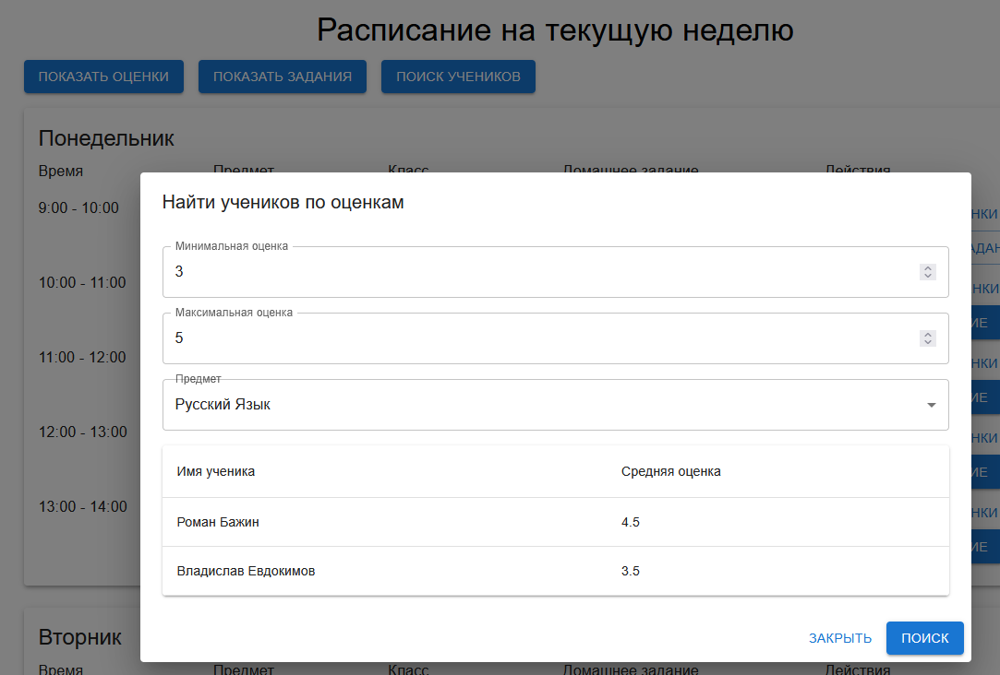

# Проект Школьный Электронный Дневник

### Используется React(Клиент), WEB-API ASP.NET Core(Сервер), База данных PostgreSQL
#### У проекта пока нет дизайна, дизайн будет после окончания разработки серверной части. Пока все запросы находятся в одном контроллере, позже сделаю нормальное распределение.

### Окно Авторизации

### Панель Админстратора

### Панель Админстратора(создание расписания)

### Панель Преподователя

### Панель Ученика

### Так выглядят все окна с настройками и созданием

### Окошко выставления оценок за занятие или за контрольные и самотоятельные работы

### Окно поиска учеников по средней оценке
